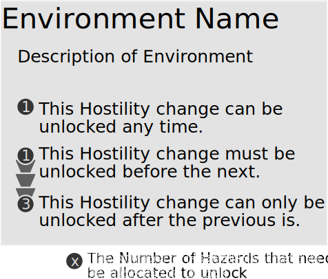

# Ecosystems

The ecosystem encapsulates the location that encounters occur. You may have a single encounter or many encounters set in an ecosystem. The ecosystem should provide a contextual description of the surroundings, creatures, and interactions of the area being explored. Ecosystems, while beginning as a backdrop, will begin to present obstructions, challenges or threats when they become more hostile, as you spend your Hazards.

When mapping out the point crawl map for a session, make sure you track the hostility of each Ecosystem so when the Mutated leave and return the Ecosystem continues to provide a challenge.

## Building Ecosystems

Ecosystems are comprised of two components, a description and hostility. The description will detail the flora and fauna found in the ecosystem, the landscape, and any other features. Make sure that when creating the ecosystem you focus on its more or less permanent features. Seasons and weather are controlled by the weather hexes, and the interactions and dangers are described by the hostility.

The second component - hostility - outlines a list of changes that the ecosystem evolves through. When increasing the hostility, you can spend the number of hazards listed to change the ecosystem as described.

## Spending Hazards on Ecosystems

The Ecosystem's Hostility increase only unlocks when the stated number of Hazards are allocated to the chosen change. For some ecosystems you can unlock any new change in any order. However, some must be unlocked in the order specified. If one change requires a previous change there will be an arrow connecting them indicating that the first change must be unlocked in order to allocate Hazards to the next one.

## Example Ecosystems

### The Dark Caves

The deep tunnels echo, teeming with beasts the light dares not shine on. All creatures in the Dark Caves are granted the Blinded Condition, if no light source is ignited.

- **Sulphur Leaks:** The stench of the sulphur overwhelms some of the tunnels. Gain the Disgusted Condition for the aromatic system.
- **Cave In:** Rock and rubble crash down into the one of the tunnels. Close of one of the connections to an ecosystem. It can no longer be traversed.

### The Flooded River

The murky waters of the river race downstream. Remnants of old structures rise from the river basin. A rickety bridge connects the banks.

- (1) **Bridge Fall** The bridge collapses into the river.

1. (1) **Rapids:** The river hastens, crossing the river is challenging. If a creature falls in it is swept downstream to the next ecosystem.
2. (3) **Flood:** A surge of upstream water floods the ecosystem submerging it. The ability to swim is required to navigate the ecosystem easily.

### The New Colony

Organised civilisation is rare in the world of Chimaera. A town of shacks, nests and holes make up the dwelling of the unique denizens.

1. (1) **Rumours:** Rumours of the Ghastly Mutated make there way across town. People are distrusting and wary.
2. (2) **Riots:** The impact of the Ghastly Mutated has caused long-lasting issues with the ecosystems. Causing shortages of food and water, protests and riots begin to break out.
3. (3) **Collapse:** The colony's collapse is imminent, riots and violence break out. Many flee the colony.

### The Muddy Marshes

An unstable and infested sludge peppered with long reeds where the air reeks of rot.

- (1) **Stinky Swamp:** Burps of disgusting vile bubble up from the marshes. Any creature that gets covered in mud gains the Disgusted Condition for the endocrine and integumentary system.
- (2) **Blood Suckers:** Small Leach insects infest the mud. The blood suckers spread disease through their bite. When attached to a creature they Inhibit a random Body System.
- (2) **Sinkholes:** Cavities open up in the mud. When walking through the mud you begin to sink. After two consecutive turns in the mud you are submerged granting the Suffocating condition.

### The Precarious Peaks

Jagged cliffs and sharp inclines extend above the cloud line.

1. (2) **Earthquakes:** The peaks shift with a rumble, causing a landslide, you have 1 Action to take cover. After the Earthquake a new route through the Mountains is opened. The GM will make a new connection from this ecosystem to another.
2. (4) What was thought to be a mountain is a volcano. Ash spews into the sky causing all ecosystems to be plunged into a permanent night. Lava flows done the volcano, touching the lava grants the Burning Condition.

### The Quiet Woods

An eerie forest of tall dark oak. The crackle of the leaves as you walk is all that dares make a noise.

- (3) **Mazed Woods:** Every tree looks the same, and you've got all turned around. When trying to leave the woods without a guide, you travel to a random connected ecosystem.
- (1) **Thorns and Brambles:** The underbrush is dotted with thorn bushes and brambles. Take 1 Physical Injury if you are entangled by  the thorns.
- (1) **Hunting Traps:** Traps of an advanced construction have been laid out among the woods. The traps are Challenging to spot.
  - _Snare:_ A loop catches the foot or arm or neck of the creature and hoists them into the air
  - _Cage:_ A cage with a lure locks the creature inside if they get to close
  - _Pitfall:_ A false covered floor drops the creature a distance of Close or Near.
  - _Deadfall:_ A swinging log knocks the creature a distance of Near causing them to go Prone.

### The Ruined City

A desolate urban wasteland, where crumbling skyscrapers and debris-strewn streets are overgrown with invasive weeds

- (1) **Grease Spills:** Grease lines some streets, stepping on the grease causes you to slide to the end of the spill, you have 1 Action to avoid sliding. The Grease is flammable.

1. (1) **Sirens and Lights:** The Sirens of rusted vehicles and rubbled buildings blare. Gain the Deafened Condition. Creatures from the ecosystem are attracted to the sound and lights.
2. (3) **Electrical Surge:** A Mains short has triggered electrical surges. When near a power pole, a building or another source of electricity, you may get electrocuted. You have 1 Action to avoid the surge. If you fail to avoid it take 1 Internal Damage.

### The Sea Shore

Where the sand and rocks of familiar land meet the expanse of the ocean, the unpredictable tides a force untamed.

- (2) **Coral Traps:** The coral blooms with poisonous spines. Getting pricked by one grants the Poisoned Condition.

1. (2) **Flash Wave:** Flash Waves sweep all creatures into the deep water.
2. (3) **Whirlpool:** A riptide draws creatures to the whirlpool. The creatures have 1 Action, to escape before being plunged to the sea floor.

### The Toxic Wastes

A land scarred by chemical spills, radiation and fungus. Only the most brutal of Mutated creature survive the wastes.

- (2) **Tar Pits:** Pits of sticky black oil scatter the wasteland. It is a Challenge to climb or be pulled out. Instead of granting a hazard on a failure, the tar hardens on one of your limbs, preventing its use until it is melted off.

1. (1) **Myceliating Fungus:** The fungus begins to spread.
   - Touching the fungus causes a Body Part to become infected with fungus spores.
   - If you are infected and travel to another ecosystem, Resolve a Challenge, if you draw a card with only 1 or 2 bone fragments, the fungus has infected the ecosystem and will begin to grow there.
   - Dealing a Physical Injury to the Fungus causes it to spray Acid in radius of near, Granting anything within that radius the Acid Condition.
2. (4) **Fungus Rot** The Fungus digests all infected ecosystems. Every infected ecosystem becomes the Toxic Wastes. Any infected Body Parts rot away becoming Obliterated.

### The Vibrant Jungle

A lush and teeming ecosystem overloaded with exotic colour, chirps, flora and fauna.

- **Tangling Vines:** Vines mingle among the jungle, getting caught in them grants the Restrained Condition, until you can be untied or cut out.
- **Poisonous Bloom:** Beautiful flowers release a poisonous pollen into the air that grants the Poisoned Condition when inhaled.
