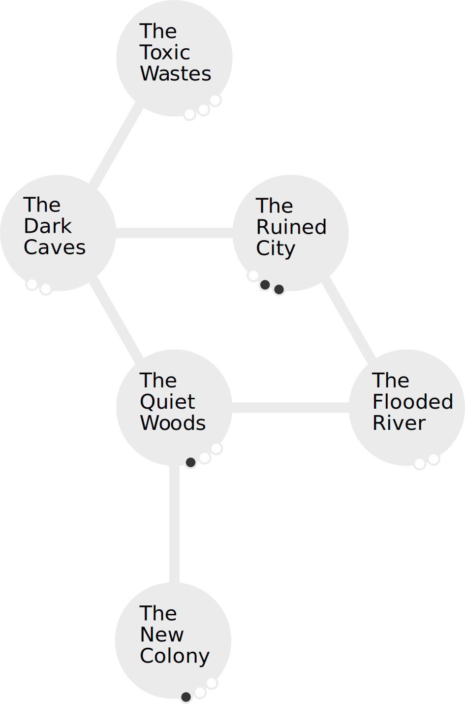

# Expedition

As the GM it is your role to create the expedition. The expedition includes the ecosystems and how they are connected, the denizens of those ecosystems, and the Ghastly Mutated that puts them all under threat.

The mutated will set out on the expedition to defeat the Ghastly Mutated. They will explore the ecosystems, gathering Body Parts and tracking down the Ghastly Mutated before it causes irreparable damage.

Below is an example of how ecosystems are connected. The Mutated can travel from the New Colony to the Quiet Woods. From the Quiet Woods they can travel to the Flooded River or the Dark Caves, or back to the New Colony.

When creating the expedition also be sure to add Facilities, Societies and Cults to the ecosystems. There is more to ecosystems than just their description and hostility.
