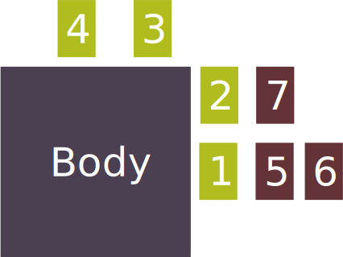

# Actions

Play is broken down into Actions. Whenever the Mutated want to complete a task, such as attacking a creature, climbing a cliff face, or manipulating a colonist, they must do so using Actions. An Action requires a goal (the thing the Mutated is trying to do), a limb (the Body Parts the Mutated will Activate), and a description of how the set of connected Body Parts will achieve the goal.

## Action Goals

A single Action can only have one goal. The goal may be a single target or a particular task.

> **Example Goals:**
> Attacking one creature
> Damaging a group of creatures at once
> Convincing a townsperson to do something
> Setting up a trap
> Traversing a hazardous bridge

## Actions and Body Parts

To execute the action you must Activate a Body Part that is directly connected to the Body. Other Body Parts that are connected to that Body Part are also Activated. The player must then describe how the Mutated use all this connected Body Parts to achieve the goal.

All Activated Body Parts must be used in service of the chosen goal for the Action. They can't change target halfway through resolving each Activation, and there effects can't be ignored in the Action either.

> For example imagine a creature with a poison gland Body Part, and their task was to poison a creature. There are different ways that this could be achieved depending on how the Body Parts are connected.
> **The Poison Gland is Attached directly to the Body:** The Mutated could Activate to squeeze some posion out onto some food.
> **The Poison Gland is Attached to Cheetah Legs which are direclty Attached to the Body:** The Mutated could activate the legs to sprint across a hallway, and within the same Action leave a poison trail.
> **The Poison Gland is Attached to the Body, and Cheetah Legs are attached to the Poison Gland:** The Mutated Activate the Gland which produces little rolling globules that can travel the distance of the cheetah legs.
> **Wings are Attached to the Body, Bristles are Attached to the Wings and the Poison Gland is Attached to the Bristles:** The Mutated Activate the Wings, flying high, then shoot their bristles into the creature and inject poison into it's blood stream all in one Action.

> When resolving an Action with a limb of multiple Body Parts, all Body Parts must be used within the Action, furthermore the execution of each Body Part's abilities must all serve the same task. In the last example the Mutated would not be able to shoot their bristles at one creature, fly to another and poison that creature. This is because the action is attempting to resolve two different tasks (shooting one creature and poisoning Another).
>
> If the creature wanted to do that then they should mutate so that the bristles are directly connected to their body. And the wings and poison gland are in a limb attached to the body separately.

Additionally, all Body Parts in limb must be used when Activated. In the last example the Mutated wouldn't be able to just shoot the bristle and inject the poison. They must also determine how the wings are involved in the Action.

### Activating Body Parts

- The Body Parts 1-4 are Body Parts that can be Activated as they are directly attached to the Body.
- The Body Parts 5-7 are connected to other Body Parts and so are Activated indirectly.
- Activating Body Part 4 doesn't Activate any other Body Parts.
- Activating Body Part 2 will also Activate Body Part 7
- Activating Body Part 1 will also Activate Body Part 4 and 5
