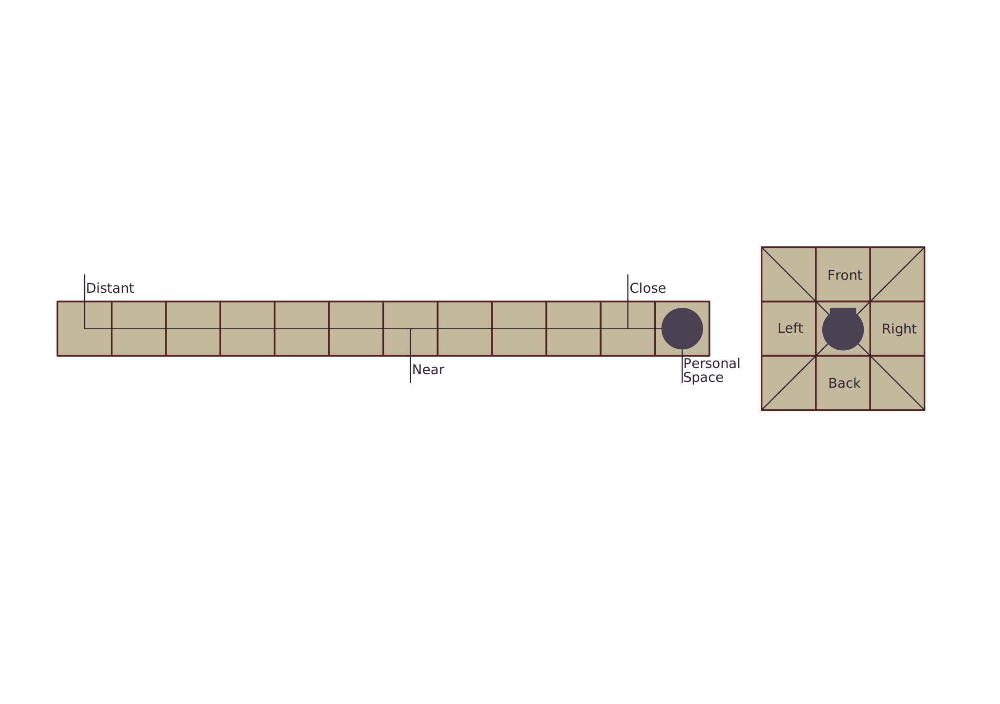

# Distance and Direction

Sometimes an Ability will require the Mutated to be a certain distance from the opposing creature. Or a Body Part providing defence will only protect in a particular direction.

There are five Distances: Afar, Distant, Near, Close and Personal. In general Personal is occupying the same space, Close is within punching range, Near is within walking distance, Distant is within running distance, and Afar within throwing range. Each distance level roughly doubles how far away you are from something.

In addition, there are four Direction: Front, Left, Right, Back, which determine on which side of you an opposing creature may be.

## Moving

Abilities that allow for movement will describe to what distance you can move toward a target. When using the ability you are able to move to any lesser distance toward your target. For example:

> "You can move up to anywhere Near you. You are Near an enemy that you want to get to." This means you can either get Close to the enemy, or get within Personal Space of the enemy.

> "You can move up to anywhere Near you. You are Distant from a door you want to go through." This means you can get Near to the door.

> "You can fly up to anywhere Distant to You. You are Distant from tree you want to land on." This means you can get Near, Close, or into Personal Space of the tree.

## Falling

When falling you will take a certain amount of Physical and Internal Injuries depending on the Distance you fall with nothing to break your fall, as per the following:
Close: 1 Internal Damage
Near: 1 Internal Damage and 1 Physical Damage
Distant: 2 Internal Damage and 2 Physical Damage
Afar: 3 Internal Damage and 3 Physical Damage

> [!TIP] Mind And Matter
>
> This method of Distance and Direction aims to facilitate minatureless play. If instead you wish to run a game with miniatures, to showcase some wacky and horrifying creatures, the Distances and Directions can be adapted as follows:
>
> Playing on square grid the distances translate to the following number of squares:
>
> - **Afar:** Within 24 Spaces
> - **Distant:** Within 12 Spaces
> - **Near:** Within 6 Spaces
> - **Close:** Within 1 Space
> - **Personal:** Occupying Same Space
>
> The Directions work by extending lines at 45 degree angles from the location of the creature. If falling between the lines then you are on that side of the creature, if you are on the 45 degree line then you have visibility of two sides.
>
> 
