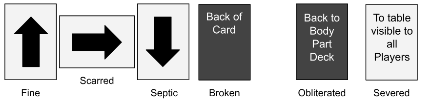

# Breaking the Body

## Injury

When the Mutated gains an injury whether from an attack or an accident, they must choose which Body Part they want to injure. Similarly, when dealing an injury to another creature they get to choose which Body Part to Injure.

### Injury Types

There are two types of Injury you can receive Physical and Internal. Both Injuries a resolved in the same way see a Taking an Injury below. Some Body Parts may grant resistance or defences to particular Injury types.

- **Physical:** Represents brute injuries such as scratches, breaks, and punches
- **Internal:** Represents illness injuries such as poisons, diseases, and ruptures

### Taking an Injury

When taking an Injury, you must select one Body Part that is connected to the Body and increase its Disrepair by the number of Injuries dealt. If increasing the disrepair would cause it to become Broken, then all other Body Parts that are part of the same Limb cannot be used either as if they too are Broken. Similarly, if the Body Part becomes Severed or Obliterated, then so too does all the other connected Body Parts.

>[INFO]
> When Mutating with Mutagenic Cells you can rearrange the order of the Body Parts so that injured Body Parts don't disable an entire limb.

>[INFO] Defeat
> If a Creature has no Body Parts left after taking an Injury they become Defeated. This means they are unable to participate in the turn order until they are given a new Body Part and Activate their Mutagenic Cells.

### Dealing an Injury

When dealing an injury select which limb you want to injure of the creature you are targeting. The GM will then decide which Body Part in the limb take the Injuries dealt.

>[!INFO]
> Some Body Parts allows you to ignore 1 more injuries of a certain type either Physical or Internal. This allows you to reduce the number of Injuries taken each time you are targeted by another's Action. For example if a Creature Activates two Body Parts, That are part of a limb, that both Deal 1 Physical Damage, and you have a Body Part that allows you to Ignore 1 Physical Damage. Then You will only take 1 Physical Damage.

<!-- Need an example Graphic of losing multiple Body Parts -->

## Disrepair

1. **Healthy:** The Body Part functions normally and is at full health
2. **Scarred:** The Body Part is still functioning but appears bruised and cut.
3. **Sceptic:** The Body Part is heavily damaged puss seeping from deep wounds.
4. **Broken:** The Body Part no longer works and rests limp on your body.

> If you decide to take an Injury to a Broken Body Part, it becomes Obliterated, meaning it is discarded and cannot be healed.

### Special States of Disrepair

Some Abilities will allow for the following special states of Disrepair.

- **Obliterated:** The Body Part is completely destroyed, it cannot be healed and is no longer attached to the Body. It can’t be picked up and used. It is now bloody mush on the floor.
- **Severed** The Body Part is torn off from the Body. It will fly in the air to the creature that severed it. They can then spend an Action to take the Metamorphosis Ability, to attach the severed piece.

>[!TIP]
If playing with Body Part cards, the orientation of the cards will correspond to the level of disrepair:
> 
> Alternatively you can use paperclips to mark the Disrepair level.
