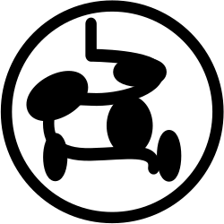

# The Body and Mutation

The body is the core of the Mutated, it grants basic Body Parts that allow the Mutated to move, attack, see, hear, think, and maintain life.

## The Body's Systems

Each Body Part belongs to a Body System. Body Systems represent the biological processes of the Mutated.

-  The Mutated's ability to see, observe, and notice visual detail.
-  The Mutated's ability to hear, listen and notice sonic detail.
-  The Mutated's ability to smell, taste and notice chemical detail.
-  The Mutated's ability to think, reason and notice logical detail.
-  The Mutated's ability to resist disease, heal, and process toxins.
-  The Mutated's ability to gain energy, regulate hormones and survive the environment.
-  The Mutated's ability to move, lift and bend.
-  The Mutated's ability to endure hardship, appearance, and structure.

> Sometimes Body Systems will be Inhibited such as darkness inhibiting the sight system. Or a poison inhibiting the circulatory system, or being bound inhibiting the muscular system. When a system is inhibited using Body Parts in that system are prevented entirely.
>
> Creatures can use their Action to clear Inhibited systems if they can justify it
>
> A creature can also intentionally Inhibit a Body System to avoid harmful conditions that only effect creatures with a particular Uninhibited Body System.

## Mutating

The creatures of Chimaera are mutanous, always tearing off and re-fusing Body Parts in response to the wild and hazardous environment. When mutating you can rearrange your Body Parts allowing to use your Body Parts in different ways.

### Attaching Body Parts

Each Body Part can be attached directly to the Body or to another Body Part. You must have at least one Body Part attached to your Body. You can attach as many Body Parts to your Body as you like. Each Body Part can only have one other Body Part attached to it, but that last attached Body Part can have another Body Part attached to it, allowing you to form limbs of many Body Parts.

- Body Parts 1-4 are directly Attached to the Body
- Body Parts 5-7 are Attached to other Body Parts
- Body Parts 5 and 6 are Attached to Body Part 1

### Body Part Arrangement

#### Many Individual Body Parts vs One Large Limb

The Mutated may have multiple Body Parts Attached into a single limb or many Body Parts attached separately to the Body. Limbs allow efficient use of Actions, enabling multiple Body Parts to Activate in the same Action. However, this reduces the amount of Injuries you can take. For example, if wings and a poison gland are part of the same limb, you could fly to and poison a creature in a single Action. However, if the wings are Severed off so to would the Poison Gland. If they're separate, the wings could be Severed and the Poison Gland would remain, but it would take two Actions to Activate both Body Parts.

#### Order of Body Parts

When executing Actions with Body Parts you create a description of how the Body Parts achieve the goal you have set. This means that the arrangement of which Body Part is Attached to which other and which Body Part is attached to the Body can change how that action could be justified. For example, A creature with Pointy Horns attached to a Slater's Shell when Activating the Slater's Shell they roll toward the enemy and then stab the creature with their horns. However, if instead the Slater's Shell was attached to the Horns, the Player Activates the Horns stabbing the creature, then rolls into a ball with the creature moving both of them.

[!Keywords]
> **Body:** The basic set of Body Parts that form the creature
> **Body Parts:** Grant and execute Abilities when Activated
> **Limb:** A set of Body Parts that are connected to each other (All Body Parts in a limb are Activated on an Action)
> **Body System:** Groups Body Parts together based on type. If the Body System is inhibited then Body Parts of that type cannot be Activated.
