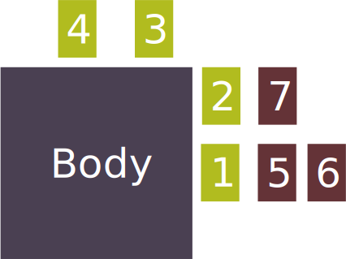

# The Body and Mutation

The body is the core of the Mutated, it grants basic Body Parts that allow the Mutated to move, attack, see, hear, think, and maintain life.

## The Body's Systems

Each Body Part belongs to a Body System. Body Systems represent the biological processes of the Mutated.

-  The Mutated's ability to see, observe, and notice visual detail.
-  The Mutated's ability to hear, listen and notice sonic detail.
-  The Mutated's ability to smell, taste and notice chemical detail.
-  The Mutated's ability to think, reason and notice logical detail.
-  The Mutated's ability to resist disease, heal, and process toxins.
-  The Mutated's ability to gain energy, regulate hormones and survive the environment.
-  The Mutated's ability to move, lift and bend.
-  The Mutated's ability to endure hardship and break things.

> Sometimes Body Systems will be Inhibited such as darkness inhibiting the sight system. Or a poison inhibiting the circulatory system, or being bound inhibiting the muscular system. When a system is inhibited using Body Parts in that system become difficult or are prevented entirely.

## Mutating

The creatures of Chimaera are mutanous, always tearing off and re-fusing Body Parts in response to the wild and hazardous environment. When mutating you can rearrange your Body Parts allowing to use your Body Parts in different ways.

### Attaching Body Parts

Each Body Part can be attached directly to the Body or to another Body Part. The order of attachment may affect the resolution of your Actions. You must have at least one Body Part attached to your Body. You can attach as many Body Parts to your Body as you like. Each Body Part can only have one other Body Part attached to it, but that last attached Body Part can have another Body Part attached to it, allowing you to form limbs of many Body Parts.

- Body Parts 1-4 are directly Attached to the Body
- Body parts 5-7 are Attached to other Body Parts
- Body Parts 5 and 6 are Attached to Body Part 1
